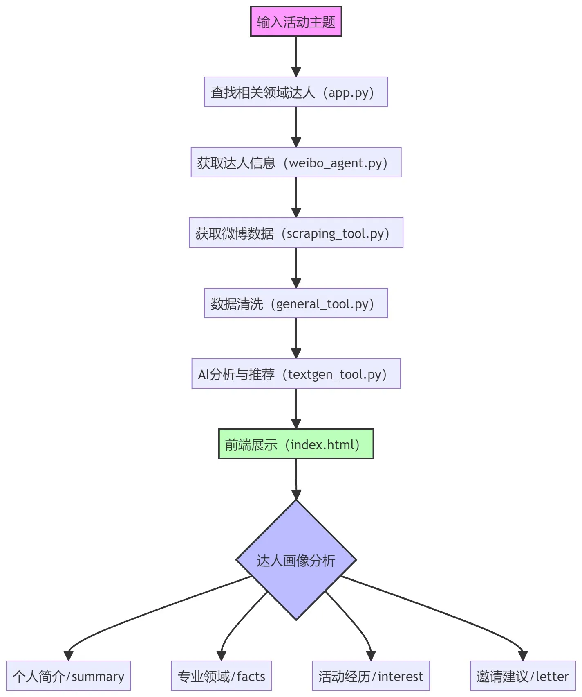

#  活动嘉宾智能推荐系统  
## 项目背景
随着高校学生社团活动日益丰富，各类文艺演出、学术讲座、公益活动等层出不穷。学生会和各社团在组织活动时，**经常需要邀请相关领域的专业人士或有影响力的嘉宾来进行分享和互动**。然而，寻找并联系合适的嘉宾往往是一个比较耗时且具有挑战性的任务。

经调研发现，许多优秀的分享嘉宾都活跃在微博平台上，学生们也经常通过微博了解这些领域达人的动态。因此，学生会提出需求，希望能有一个工具帮助他们更好地发掘和联络潜在的演讲嘉宾。

## 项目目标
开发一个"校园社交助手"工具，帮助学生会和社团成员快速找到适合某个特定主题（如摄影、音乐、编程等）的微博达人。

## 项目技术实现细节
具体实现分为以下五个步骤：

1. **达人发现**：使用LangChain的搜索工具，通过模糊搜索方式找到与特定主题相关的微博达人，并获取其UID。
2. **信息采集**：根据获取的UID，使用爬虫工具收集达人的微博公开信息，并以JSON格式返回数据。
3. **内容生成**：通过LangChain调用LLM，对达人信息进行分析总结，自动生成合适的邀请函。
4. **数据结构化**：使用LangChain的输出解析功能，将LLM生成的内容转换为格式化的数据结构。
5. **界面实现**：使用Flask框架搭建Web应用，添加HTML和CSS样式，部署成可用的网络工具。

本项目综合运用了LangChain的多个技术要点，包括提示工程、模型调用、链式处理、代理模式和输出解析等，

